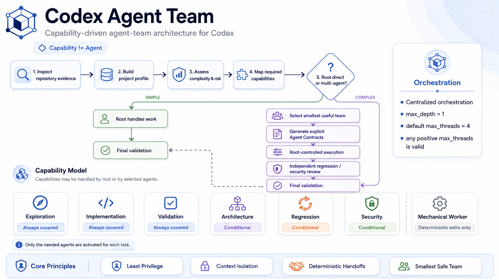
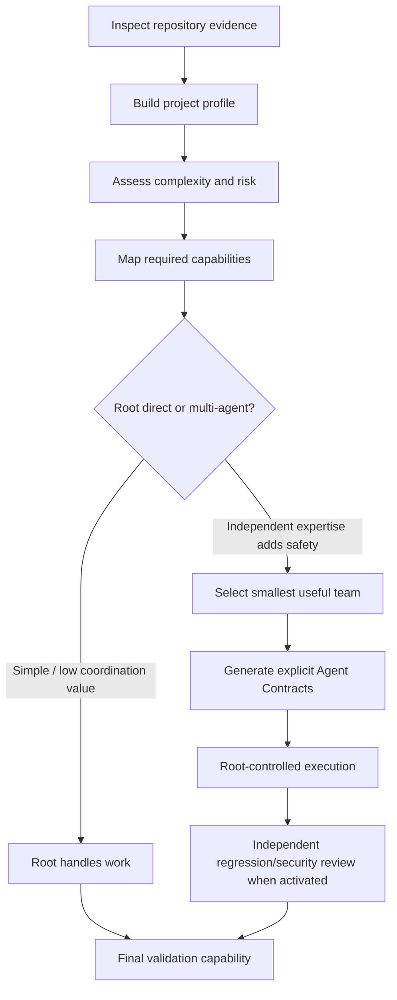

# codex-agent-team



A dependency-free Codex skill that inspects a software repository and installs the smallest useful,
project-specific agent team for its actual architecture, task complexity, and risks.

It generates explicit Agent Contracts, a lightweight evidence-backed project/capability profile, bounded
root-owned orchestration, and deterministic validation without copying assumptions from another stack.

## Model

`Capability != Agent`.

Exploration, implementation, and validation must always be covered. Architecture, regression assessment,
and security review are conditional. Each capability may be handled by root, a generated agent, a
compatible existing specialist, or—when conditional—left conditional/not applicable with an explicit
evidence-backed justification.

Adding agents is not inherently better:

```text
Use the minimum number of agents necessary to safely satisfy the task.
```

The skill follows this pipeline:



Framework detection alone never selects a role. The profile first records verified behavior—such as auth,
persistence, networking, or integrations—and its risk. That evidence drives capabilities, and capabilities
drive team selection.

## Centralized orchestration

The root Codex session is the only orchestrator. `max_depth = 1` remains mandatory: subagents report new
work or ambiguity to root and never create autonomous chains. Read-only roles cannot fix findings.
Write-capable roles receive exact, exclusive scope.

Parallel execution is conservative. Independent backend, frontend, or documentation work may overlap when
ownership and decisions do not. Explorer -> Architect -> Worker -> Review -> Validator is a dependency
chain and stays sequential. `max_threads` is capacity, not a concurrency target; any positive value is
valid, including `1`, and the generated default is `4`.

Independent Review / Context Isolation reduces confirmation bias. Later reviewers receive the original
requirement, constraints, final diff, acceptance criteria, and objective test/security evidence—not
persuasive conclusions from earlier agents.

## Generated files

The skill may merge or create:

```text
.codex/agent-team.toml   # project, stack, features, risk, capability modes
.codex/agents/*.toml    # only selected Agent Contracts
.codex/config.toml      # bounded root-owned orchestration
AGENTS.md               # complexity gate, ownership, handoffs, escalation
PLANS.md                # decisions, work, acceptance, evidence trace
```

`.codex/agent-team.toml` is intentionally small and uses standard TOML. It exists so coverage and
contradictions can be validated deterministically without an LLM, external schema package, or brittle
role-count rules.

## Agent Contracts and handoffs

Every generated contract contains exactly:

```text
ROLE
OBJECTIVE
INPUTS
RESPONSIBILITIES
PERMISSIONS
STOP / ESCALATION CONDITIONS
OUTPUT
```

Delegations specify objective, scope, input evidence, required behavior, constraints, preservation and
exclusion boundaries, acceptance criteria, escalation conditions, and expected output. Non-trivial work
may use lightweight `R# -> E# -> D# -> W# -> T#/S# -> V#` trace IDs; trivial work does not need ceremony.

Implementation follows `SMALLEST SAFE DIFF`. The optional `mechanical_worker` is limited to fully specified
deterministic edits and stops when architecture, security, data-model, or unspecified behavior judgment is
required.

## Requirements

- Codex with skills and project-agent support.
- Python 3.11 or newer for the bundled validator.
- No third-party runtime dependencies.

## Install

Using the Skills CLI:

```bash
npx skills add https://github.com/sherafat79/codex-agent-team
```

Or clone the repository manually.

macOS or Linux:

```bash
git clone https://github.com/sherafat79/codex-agent-team.git ~/.agents/skills/codex-agent-team
```

Windows PowerShell:

```powershell
git clone https://github.com/sherafat79/codex-agent-team.git "$env:USERPROFILE\.agents\skills\codex-agent-team"
```

Codex detects skill changes automatically. If the skill does not appear, restart Codex.

## Use

Invoke the skill from the repository to configure:

```text
Use $codex-agent-team to inspect this repository and install an adaptive capability-driven agent team.
```

## Validate an installation

```bash
python ~/.agents/skills/codex-agent-team/scripts/validate_agent_team.py --project /path/to/project
```

Use `--plan-file` for a non-default plan template and repeat `--forbid-term` for irrelevant source-stack
terms that must not appear in generated workflow files. Validation parses TOML and contract sections,
checks capability coverage and agent/objective links, enforces least privilege and scoped writes, detects
obvious read-only/write contradictions, and keeps `max_depth = 1` strict.

## Migration from earlier releases

Existing installations should regenerate or add `.codex/agent-team.toml`, rename `fast_worker` to
`mechanical_worker`, change the final contract heading from `OUTPUT SCHEMA` to `OUTPUT`, and make scoped
write restrictions concrete. The legacy speed-based worker name is rejected with a migration message; it
is not retained indefinitely as an alias.

## Development

Run the dependency-free test suite:

```bash
python -m unittest discover -s tests -v
```

CI runs the same command on Python 3.11.

## Security

Review generated contracts before using them on sensitive repositories. Security Reviewers focus on the
changed attack surface and report actionable attack/failure paths; they remain read-only. Report suspected
vulnerabilities privately through the repository's GitHub Security page.

## License

[MIT](LICENSE)
